<div align="center">

<picture>
  <source media="(prefers-color-scheme: dark)" srcset="assets/terminal-dark.svg">
  
</picture>

<a href="https://ahmetbsbnr.com"></a>
<a href="https://www.linkedin.com/in/ahmet-basbunar/"></a>
<a href="mailto:contact@ahmetbsbnr.com"></a>


</div>

<br>

Je m'appelle **Ahmet**. Je conçois et je développe des applications de bout en bout : le modèle de données, la logique, l'interface et les tests.
Je suis en 2e année de **BUT Informatique** à Metz, parcours *Réalisation d'applications*. En parallèle, j'ai publié **CoreTend**, une application macOS native.

> J'essaie d'apprendre vite sans survendre mon niveau.

<br>

## `$ ls ~/projets --featured`

<table>
<tr>
<td width="44%" valign="top">

<a href="https://github.com/ahmetbsbnr/coretend">
<picture>
  <source media="(prefers-color-scheme: dark)" srcset="https://raw.githubusercontent.com/ahmetbsbnr/coretend/main/Website/screenshots/home-fr-dark.png">
  
</picture>
</a>

</td>
<td valign="top">

###  [CoreTend](https://github.com/ahmetbsbnr/coretend)

**Voir ce qui remplit son Mac, et le libérer sans risque.**
Application macOS native, gratuite et open source.

- Quatre espaces : Accueil, Espace (carte du disque, doublons), Nettoyer (14 règles en une passe, avec Annuler) et Apps (désinstallation complète)
- Rien n'est jamais effacé définitivement : tout passe par la Corbeille, avec Annuler
- Aucun compte, aucune télémétrie
- Swift 6 et SwiftUI, modules séparés, SQLite, **207 tests automatisés**
- Signée Developer ID et **notarisée par Apple**, distribuée par le site, GitHub, Homebrew et npm (CLI et serveur MCP)

<a href="https://coretend.ahmetbsbnr.com"></a>
<a href="https://github.com/ahmetbsbnr/coretend/releases/latest"></a>


</td>
</tr>
</table>

<br>

## `$ ls ~/projets/terminal`

Des jeux en C qui tournent dans le terminal : de l'algorithmique, de l'état de jeu et un peu de stratégie.

| | Projet | En une ligne |
|:-:|---|---|
| ♟ | [**jeu-de-nim**](https://github.com/ahmetbsbnr/jeu-de-nim) | Un pion, un puits, et un ordinateur qui joue sur 4 niveaux, jusqu'à la stratégie optimale calculée par *nimbers* |
| 🃏 | [**memoryx**](https://github.com/ahmetbsbnr/memoryx) | Un Memory avec un Joker qui brouille les cartes, et un bot qui se souvient de tout ce qu'il a vu |
| 🎯 | [**jeux-de-confrontation**](https://github.com/ahmetbsbnr/jeux-de-confrontation) | Nombre caché, suite mystère et Mastermind de voyelles, avec suivi des moyennes |
| ✖ | [**jeu-x**](https://github.com/ahmetbsbnr/jeu-x) | Deux joueurs posent leurs jetons et il reste une case libre : la plus petite somme autour gagne |

```sh
git clone https://github.com/ahmetbsbnr/jeu-de-nim && cd jeu-de-nim
gcc -Wall -o nim JeuDeNim.c && ./nim
```

<br>

## `$ ls ~/projets/web`

| Projet | Ce que ça fait | Stack |
|---|---|---|
| [**sat-securite-avant-tout**](https://github.com/ahmetbsbnr/sat-securite-avant-tout) | Gestion des interventions d'une entreprise de sécurité : contrats, clients, prestations, calcul HT/TVA/TTC. Réalisé avec [@Victorlng7](https://github.com/Victorlng7) | TypeScript · MySQL · HTML/CSS |
| [**club-themactu**](https://github.com/ahmetbsbnr/club-themactu) | Application MVC de gestion des adhérents et des abonnements d'un club | TypeScript · MySQL · HTML/CSS |

<br>

## `$ cat stack.txt`

<p>


</p>
<p>


</p>

Côté données : MCD et MRD (Looping), contraintes, jointures, agrégations, sous-requêtes. Côté méthode : tests unitaires et fonctionnels, Git, travail en équipe. Je pratique aussi le développement assisté par IA, en gardant la main sur l'architecture et les décisions.

<br>

## `$ git log --reverse ~/parcours`

```diff
  2021  Seconde générale, option SNT ··········· Creutzwald
  2022  Bac STI2D, option SIN ·················· Metz
+ 2024  BUT Informatique · Réalisation d'applications · IUT de Metz
+ 2026  CoreTend publiée : signée, notarisée, sur Homebrew et npm
@@ 2027  Stage de 2 mois minimum, dès le 12 avril : votre équipe ? @@
```

<br>

## `$ man ahmet`

<table>
<tr>
<td valign="top" width="50%">

**LANGUES**
- Français : langue maternelle
- Turc : langue maternelle
- Anglais : B2
- Allemand : A1

</td>
<td valign="top" width="50%">

**HORS DE L'ÉCRAN**
- Handball, judo, musculation
- Échecs (logique, encore et toujours)
- Photographie
- Musique

</td>
</tr>
</table>

**CERTIFICATIONS**
- Claude Academy (Anthropic), 2026 : [AI Fluency: Framework and foundations](https://academy.claude.com/verify/cb496fb08a19baa295376548f2cebbb3) · [AI Fluency for builders](https://academy.claude.com/verify/cdda93c1bef3e439d4932c3f725c0aa5) · [AI capabilities and limitations](https://academy.claude.com/verify/b88993ac507900f8512a3e194f7ea05f) · [Building effective human-agent teams](https://academy.claude.com/verify/9e0df9f9e9b495d144056bc767c76609)
- Kaggle, 2024 : [Intro to Programming](https://www.kaggle.com/learn/certification/ahmetbasbunar/intro-to-programming)
- PIX, 2024 : compétences numériques

<br>

## `$ ./contact`

Je cherche **un stage de 2 mois minimum, à partir du 12 avril 2027**, dans une équipe qui fait avancer un vrai produit, à Metz, aux alentours ou au Luxembourg. Développement d'applications, web, tests, ou un projet d'IA.

<p>
<a href="mailto:contact@ahmetbsbnr.com"><b>contact@ahmetbsbnr.com</b></a> ·
<a href="https://www.linkedin.com/in/ahmet-basbunar/">LinkedIn</a> ·
<a href="https://ahmetbsbnr.com">ahmetbsbnr.com</a> (CV en ligne)
</p>

<sub><code>ahmet@metz ~ $ exit</code> — merci d'être passé.</sub>
