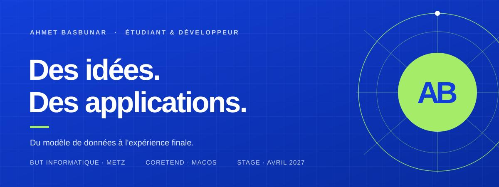

 

[Portfolio ↗](https://ahmetbsbnr.com)　·　[LinkedIn ↗](https://www.linkedin.com/in/ahmet-basbunar/)　·　[Me contacter ↗](mailto:contact@ahmetbsbnr.com)　·　[CV ↗](https://ahmetbsbnr.com/cv.pdf)

 

## Je pars du problème. Je construis jusqu'au produit.

Je suis **Ahmet Basbunar**, étudiant en 2e année de BUT Informatique à l'IUT de Metz, parcours Réalisation d'applications. J'aime prendre un besoin concret, comprendre ses données et ses contraintes, puis en faire une application cohérente — jusqu'aux tests et à la distribution.

En ce moment, je développe des applications natives et web. **CoreTend**, mon application macOS open source, est mon projet le plus complet : conception, architecture, interface, tests et publication.

 

## Une application, de l'idée à la distribution

<table>
<tr>
<td width="52%" valign="middle">

<a href="https://github.com/ahmetbsbnr/coretend">
<picture>
  <source media="(prefers-color-scheme: dark)" srcset="https://raw.githubusercontent.com/ahmetbsbnr/coretend/main/Website/screenshots/home-fr-dark.png">
  
</picture>
</a>

</td>
<td valign="top">

### CoreTend

**Comprendre l'espace disque. Faire le ménage en confiance.**

Application macOS native, gratuite et open source.

`Swift 6`　`SwiftUI`　`SQLite`

- Explorer le stockage, repérer les doublons et désinstaller complètement des apps
- Appliquer 14 règles de nettoyage en une passe, avec possibilité d'annuler
- **207 tests automatisés** · modules séparés · aucune télémétrie
- Signée Developer ID et notarisée par Apple
- Disponible sur le site, GitHub, Homebrew et npm (CLI et serveur MCP)

[Découvrir le projet ↗](https://github.com/ahmetbsbnr/coretend)　·　[Site ↗](https://coretend.ahmetbsbnr.com)　·　[Versions ↗](https://github.com/ahmetbsbnr/coretend/releases)

</td>
</tr>
</table>

 

## D'autres terrains de jeu

### Applications web

| Projet | Problème traité | Outils |
|---|---|---|
| [S.A.T. ↗](https://github.com/ahmetbsbnr/sat-securite-avant-tout) | Suivre les contrats, clients, prestations et montants HT/TVA/TTC d'une entreprise de sécurité. Projet réalisé en binôme avec [@Victorlng7](https://github.com/Victorlng7). | TypeScript · Deno · MySQL |
| [Club ThemActu ↗](https://github.com/ahmetbsbnr/club-themactu) | Gérer les adhérents et abonnements d'un club avec une architecture MVC. | TypeScript · PHP · MySQL · tests unitaires |

### Jeux en C

| [Jeu de Nim ↗](https://github.com/ahmetbsbnr/jeu-de-nim) | Quatre niveaux d'adversaire, jusqu'à une stratégie optimale fondée sur les *nimbers*. |
|---|---|
| [Memoryx ↗](https://github.com/ahmetbsbnr/memoryx) | Un Memory avec Joker et un bot qui mémorise les cartes révélées. |
| [Jeux de confrontation ↗](https://github.com/ahmetbsbnr/jeux-de-confrontation) | Nombre caché, suite mystère et Mastermind de voyelles, avec suivi des moyennes. |
| [Jeu X ↗](https://github.com/ahmetbsbnr/jeu-x) | Un jeu à deux où la somme des voisins décide du gagnant. |

 

## Ma boîte à outils

| Je construis avec | Je travaille aussi sur |
|---|---|
| **Swift · SwiftUI · TypeScript · C · Python · PHP** | **MySQL · SQLite · SQL** |
| **Deno · HTML · CSS** | **MCD/MRD · contraintes · jointures · agrégations** |
| Architecture modulaire · tests unitaires et fonctionnels | Git · travail en équipe · développement assisté par IA |

 

## Quelques repères

**2021**　Seconde générale, option SNT · Creutzwald 
**2022**　Baccalauréat STI2D, option SIN · Metz 
**2024 →**　BUT Informatique, parcours Réalisation d'applications · IUT de Metz 
**2026**　CoreTend publiée, signée et notarisée

### À côté du code

Français et turc (langues maternelles) · anglais (B2) · allemand (A1) 
Handball · judo · musculation · échecs · photographie · musique

**Certifications** — Claude Academy (Anthropic, 2026) : [AI Fluency](https://academy.claude.com/verify/cb496fb08a19baa295376548f2cebbb3) · [AI Fluency for builders](https://academy.claude.com/verify/cdda93c1bef3e439d4932c3f725c0aa5) · [AI capabilities and limitations](https://academy.claude.com/verify/b88993ac507900f8512a3e194f7ea05f) · [Human-agent teams](https://academy.claude.com/verify/9e0df9f9e9b495d144056bc767c76609) · [Kaggle : Intro to Programming](https://www.kaggle.com/learn/certification/ahmetbasbunar/intro-to-programming) · PIX

 

## Prochaine étape : votre équipe

Je recherche un **stage de 2 mois minimum dès le 12 avril 2027**, à Metz et alentours ou au Luxembourg. Développement d'applications, web, tests ou projet intégrant l'IA : je veux contribuer à un produit utile et apprendre au contact d'une équipe.

### [Parlons de votre projet ↗](mailto:contact@ahmetbsbnr.com)

[contact@ahmetbsbnr.com](mailto:contact@ahmetbsbnr.com)　·　[Portfolio](https://ahmetbsbnr.com)　·　[LinkedIn](https://www.linkedin.com/in/ahmet-basbunar/)

